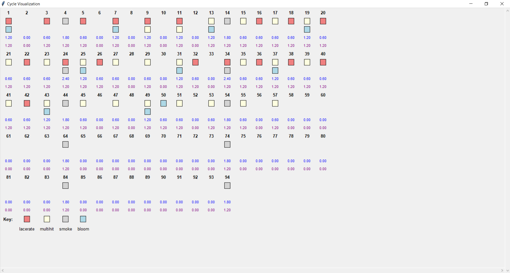

## WynnCraft Acrobat weightless simulation

this file contains:
- a simulation of acrobat's spell cycle
- comprehensive display of events each tick
- animated bar graph of mana per tick with cumulative total mana gained
  
#### 0.8 -> 1.2
<video controls src="acrobat_weightless_buff.mp4" title="0.8->1.2 buff"></video>

#### Originally proposed weightless change
<video controls src="acrobat_weightless_nerf.mp4" title="Originally proposed weightless change"></video>

#### Per tick detail
